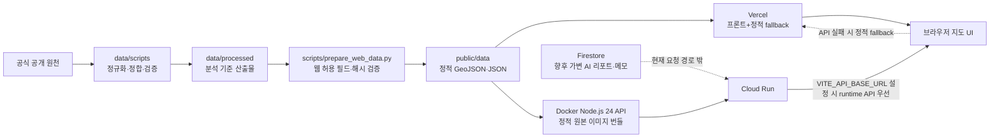

# I5 도시 돌봄

> 개인을 추정하지 않고, 공개 집계 데이터로 인천의 돌봄 현장 검토 순서를 좁히는 지도

**Live demo:** <https://incheon-care-map.vercel.app><br>
**Read-only API:** <https://incheon-care-api-vy3v2ludma-du.a.run.app> · [health](https://incheon-care-api-vy3v2ludma-du.a.run.app/health)

<!-- SCREENSHOT: 실제 배포 화면을 검증한 뒤 스크린샷과 대체 텍스트를 추가합니다. -->

## 문제와 가치

공개 데이터로는 누가 복지를 받아야 하는데 받지 못하고 있는지 확정할 수 없다. 대신 행정동별 고령·1인세대 규모와 비율, 복지시설, 대중교통, 노후 주거 맥락을 같이 보면 **어느 지역을 먼저 현장 확인할지**를 데이터와 함께 논의할 수 있다.

이 프로젝트는 자동 판정·자원 배치 시스템이 아니다. 개인정보 없이 지역 단위의 관찰 지표를 비교하고, 담당자가 실제 사례·적격성·공급 여력을 추가 확인하도록 돕는 **의사결정 보조 도구**다.

## 현재 데이터 범위

| 레이어 | 검증된 범위 | 해석 |
| --- | ---: | --- |
| 행정동 지도 | 2025 경계 156개 구역에 2026 현행 행정동 162개를 정합 | 분리된 최신 동 경계를 임의로 만들지 않음 |
| 수요 맥락 | 총인구 3,061,002명, 65세 이상 598,793명, 1인세대 559,691세대, 65세 이상 1인세대 172,426세대 | 주민등록 집계 관찰값이며 실제 독거·고립·서비스 적격성을 뜻하지 않음 |
| 복지시설 | 정규화 3,394개 중 지도 포인트 3,061개, 좌표 커버리지 90.188568% | 주민 위치가 아닌 공식 시설 위치; 일부는 주소 기반 대표점 |
| 대중교통 | 승·하차 지도 포인트 6,231개, 노선 정보 결합 6,157개 | 승·하차 건수이며 고유 이용자 수가 아님 |
| 주거 노후도 | 정규화 건축물대장 157,049건 중 150,589건 배정, strict 커버리지 95.886634% | 대장 레코드 수이며 고유 건물·주택 호수·가구 수가 아님 |

실행 중인 웹앱은 대용량 원천을 직접 읽지 않고, 검증된 정적 자산만 `public/data/`에서 불러온다. `VITE_API_BASE_URL`이 설정된 runtime에서는 Cloud Run API를 우선 사용하고, 환경변수가 없거나 API 호출이 실패하면 Vercel에 배포된 같은 정적 자산으로 fallback한다.

프론트엔드는 React 19·TypeScript 7·Vite 8·MapLibre GL JS 6으로 구성했고 OpenStreetMap 베이스맵을 사용한다. 백엔드는 Node.js 24로 작성한 읽기 전용 API며, 검증된 `public/data/`를 Docker 이미지에 번들해 Cloud Run에서 제공한다. 어느 현재 경로도 개인 데이터나 AI 추론 결과를 생성하지 않는다. 같은 GCP 프로젝트에는 향후 서버 측 AI 진단 리포트·메모를 저장할 Firestore가 준비되어 있지만, 현재 지도 요청과 정적 데이터 제공은 DB 장애와 분리되어 있다.

## 합성 ContactOps 개발 데이터

이웃연결단의 전화 안부 확인, 미응답·이상징후 후속조치, 방문 권고, 담당자 승인 흐름을 병렬 개발할 수 있도록 결정적 합성 계약을 제공한다. 현행 162개 읍면동마다 일반 표시명의 연결단원 1명과 합성 연락업무 20~50건을 생성한다. 현재 seed의 결과는 연결단원 162명, 합성 연락업무 5,869건이며 기준일 `2026-08-12`까지 연락해야 하는 업무는 3,616건이다. 선호 연락수단은 전화 5,291건, 방문 578건이고, fixture 생성 시점에 사전 승인된 방문은 0건이다.

- `public/data/synthetic-workers.json`
- `public/data/synthetic-households.json`
- `public/data/synthetic-care-ops-manifest.json`
- `data/schemas/synthetic-worker.schema.json`
- `data/schemas/synthetic-household.schema.json`
- `src/syntheticCareOpsTypes.ts`

모든 레코드는 `synthetic=true`이고 이름·주소·전화번호가 없다. 좌표는 2025 지도구역 안에 생성한 합성 점이며 실제 주거 위치가 아니다. 중심 필드는 `next_contact_date`, `preferred_contact_method`, `consecutive_no_answer_count`, `follow_up_deadline`, `follow_up_status`, `visit_approval_status`, `transfer_status`, `last_contact_result`다. `visit_approval_status`는 규칙 권고 전에는 `null`이며, 방문 제약과 `max_route_distance_km`는 담당자가 명시 승인한 뒤에만 생긴다. UI·규칙 그래프 사용법과 162→156 공간 제약은 [`docs/SYNTHETIC_CARE_OPS_DATA.md`](docs/SYNTHETIC_CARE_OPS_DATA.md)를 따른다.

현재 최소 데모는 LLM 없이 결정론적으로 돈다.

```bash
npm --prefix backend run demo:contact-ops
```

이 명령은 오늘 연락대상 큐 생성, 더미 연락결과 입력, 미응답·후속조치 규칙 검사, 방문 승격 권고, 담당자 명시 승인까지 텍스트로 보여 준다. LLM·음성 입력·경로 최적화는 아직 구현하지 않았다. 다음 순서는 전체 회귀검증, LLM 구조화·검토 레이어, 조건부 경로 게이트다.

## 지표 해석 원칙

기본 표현은 다음 두 관찰 지표를 독립적으로 보여 준다.

- `P1` 주민등록상 65세 이상 1인세대 **관찰 규모**: 버블 크기
- `P2` 65세 이상 인구 대비 65세 이상 1인세대 **관찰 비율**: 구역 채색

`P2`는 2026-07-31 세대 수를 2026-06-30 인구로 나눈 **혼합 snapshot**이다. 동시점 비율이 아니므로 날짜·분자·분모를 함께 보여 줘야 한다. 두 지표를 임의 가중치로 합쳐 `종합 위험점수`를 만들지 않는다.

다음 표현은 사용하지 않는다.

- `복지 미수혜자 수`
- `고독사 고위험자`
- `AI가 예측한 개인별 위험 확률`
- `확정된 돌봄 공백`

실제 미수혜 규모를 계산하려면 같은 기준기간의 자격·필요 판정, 신청·수급·이용 기록, 중복 제거 키와 적법한 결합 근거가 필요하다. 세부 규칙은 [`data/metadata/CARE_PRIORITY_METRIC_SPEC.md`](data/metadata/CARE_PRIORITY_METRIC_SPEC.md)를 따른다.

## 구조



| 경로 | 역할 |
| --- | --- |
| `src/` | 지도, 레이어, 필터, 정보 패널 UI |
| `backend/` | Node.js 24 읽기 전용 API, 테스트, Dockerfile |
| `public/data/` | 배포에 포함되는 브라우저용 GeoJSON·JSON |
| `scripts/prepare_web_data.py` | 검증된 산출물을 결정적으로 웹 자산으로 변환 |
| `data/raw/` | 다시 받은 공식 원천 보관 |
| `data/processed/` | 정규화·공간조인·검증 산출물 |
| `data/metadata/` | 출처, API, 체크섬, 지표 계약 |
| `.github/workflows/ci-deploy.yml` | 프론트·API 검증, Vercel·Cloud Run 생산 배포 |
| `docs/DEPLOYMENT.md` | 일회성 연동·secret·운영 절차 |

## 로컬 실행

Node.js 24와 npm을 사용한다.

```bash
npm ci
npm run dev
```

배포 전 같은 검증을 로컬에서 실행한다.

```bash
npm run validate:data
npm run typecheck
npm run build
```

로컬 API는 다른 터미널에서 실행한다.

```bash
npm --prefix backend ci
npm --prefix backend start
curl http://127.0.0.1:8080/health
```

로컬 프론트에서 API 경로까지 확인하려면 기본 `npm run dev` 대신 다음을 실행한다.

```bash
VITE_API_BASE_URL=http://127.0.0.1:8080 npm run dev
```

## 웹 데이터 재생성

`data/processed/`가 바뀌었을 때만 웹용 자산을 다시 만든다.

```bash
npm run prepare:data
npm run validate:data
```

`--check`는 임시 디렉터리에서 재생성한 6개 자산을 커밋된 `public/data/`와 바이트 단위로 비교한다. 원천부터 전체 데이터팩을 재생성하는 순서와 Python 의존성은 [`data/README.md`](data/README.md)와 [`data/requirements.txt`](data/requirements.txt)에 있다.

## API

생산 API는 <https://incheon-care-api-vy3v2ludma-du.a.run.app>에서 검증된 정적 자산을 읽기 전용으로 제공한다. 외부 헬스체크의 canonical 경로는 `GET /health`이다.

- `GET /health` — Cloud Run 외부 헬스체크
- `GET /api/v1/summary`
- `GET /api/v1/zones?district=&bbox=&limit=&offset=`
- `GET /api/v1/zones/:geometryZoneId`
- `GET /api/v1/facilities?district=&category=&bbox=&limit=&offset=`
- `GET /api/v1/transit?district=&bbox=&minTotalEvents=&minRouteCount=&limit=&offset=`

API 테스트와 생산 이미지를 로컬에서 같은 계약으로 검증할 수 있다.

```bash
npm --prefix backend run test:coverage
docker build -f backend/Dockerfile -t incheon-care-api .
docker run --rm -p 8080:8080 \
  -e CORS_ORIGINS=http://localhost:5173 \
  incheon-care-api
```

세부 쿼리 제약과 응답 계약은 [`backend/README.md`](backend/README.md)에 있다.

## CI/CD

- Pull request와 모든 push에서 Node.js 24로 웹 데이터 결정성, 프론트 타입·빌드, API 커버리지 게이트, Docker 이미지 빌드를 검증한다.
- Pull request는 배포하지 않는다. 검증을 통과한 PR이 `main`에 merge되면 프론트와 API 생산 배포를 독립된 병렬 job으로 시작한다.
- 프론트는 Vercel Production으로, API는 commit SHA 태그의 `linux/amd64` 이미지를 Artifact Registry에 push한 뒤 Cloud Run으로 배포한다.
- GitHub Actions가 프론트 배포의 단일 소유자다. `vercel.json`의 `git.deploymentEnabled=false`로 Vercel Git 자동 배포와의 중복을 막는다.
- Cloud Run 배포는 GitHub OIDC와 Workload Identity Federation을 사용하며 서비스 계정 JSON 키를 저장소에 두지 않는다.
- Firestore `(default)`는 서버 측 가변 리포트용으로만 예약되어 있고 현재 API 경로는 사용하지 않는다. 정적 지도 원천을 DB로 중복 이전하지 않는다.
- 대용량 `data/`는 배포에서 제외한다. 정적 fallback과 API Docker 이미지 둘 다 검수된 `public/data/`만 번들한다.

설정·secret 등록·장애 대응은 [`docs/DEPLOYMENT.md`](docs/DEPLOYMENT.md)에 정리되어 있다.

## 공식 출처

- 행정안전부: [행정동별 성별·연령별 주민등록 인구](https://www.data.go.kr/data/15097972/fileData.do), [1인세대수](https://www.data.go.kr/data/15097973/fileData.do)
- 인천광역시: [국민기초생활수급자 연령별 읍면동 현황](https://www.data.go.kr/data/15128192/fileData.do), [사회복지시설 현황](https://www.data.go.kr/data/15045181/fileData.do), [노인복지시설 현황](https://www.incheon.go.kr/welfare/WE010216)
- 인천광역시 교통: [시내버스 정류소](https://www.data.go.kr/data/15074309/fileData.do), [버스노선별 정류장](https://www.data.go.kr/data/15048265/fileData.do), [정류장별 이용승객](https://www.data.go.kr/data/15048264/fileData.do)
- 인천 1인가구 포털: [돌봄·안전 프로그램](https://www.incheon.go.kr/1in/OHH020108)
- VWorld: [센서스 행정동 경계](https://www.vworld.kr/dtmk/dtmk_ntads_s002.do?svcCde=MK&dsId=30017), [건축물연령정보](https://www.vworld.kr/dtmk/dtmk_ntads_s002.do?svcCde=NA&dsId=1), [GIS건물통합정보](https://www.vworld.kr/dtmk/dtmk_ntads_s002.do?svcCde=NA&dsId=18)

전체 원천 목록과 기준일은 [`data/metadata/source_inventory.csv`](data/metadata/source_inventory.csv), API 접근 조건은 [`data/metadata/API_CATALOG.md`](data/metadata/API_CATALOG.md), 파일 무결성은 [`data/metadata/checksums.sha256`](data/metadata/checksums.sha256)에서 확인할 수 있다.

## VWorld 라이선스 주의

VWorld 행정경계 페이지에는 `CC BY-NC-ND`가 표시되어 있고, 이 저장소의 GeoJSON은 지역 필터링·재투영·형식 변환·속성 결합을 거친 파생물이다. `ND` 조건에서 이 가공과 공개 재배포가 허용되는지는 확인되지 않았다. 공개 데모가 열려 있는 사실은 재배포 권리를 확정하지 않는다.

따라서 공식 서비스·상용 전환·지속적 공개 전에 VWorld의 서면 확인을 받거나 재배포 가능한 경계·건물 데이터로 교체해야 한다. 현재 근거와 공개 전 체크리스트는 [`data/LICENSES.md`](data/LICENSES.md)를 따른다.

## 저장소

- GitHub: <https://github.com/ulsaninuhack/hack>
- 배포 절차: [`docs/DEPLOYMENT.md`](docs/DEPLOYMENT.md)
