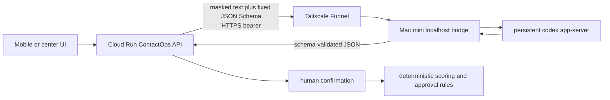

# Mac mini Codex bridge operations

This is the deployment runbook for using a home Mac mini's logged-in Codex CLI as the ContactOps
text Planner/Critic. SSH is only the administration path. Cloud Run talks to the narrow authenticated
HTTPS bridge, not to SSH and not directly to `codex app-server`.

## Data path



Audio transcription remains on the existing OpenAI transcription adapter. Only the text extraction
Planner and Critic use the Mac mini bridge.

## 1. One-time SSH bootstrap

Enable **System Settings → General → Sharing → Remote Login** for the intended Mac mini account.
From the admin Mac, verify the host and install only the public key; never paste a password or a
private key into chat or the repository.

```bash
tailscale ping MAC_MINI_TAILSCALE_HOST
cat ~/.ssh/id_ed25519.pub | ssh MAC_MINI_USER@MAC_MINI_TAILSCALE_HOST \
  'umask 077; mkdir -p ~/.ssh; cat >> ~/.ssh/authorized_keys'
ssh MAC_MINI_USER@MAC_MINI_TAILSCALE_HOST
```

## 2. Install the bridge

On the Mac mini, install Node.js 24, the Codex CLI, and Tailscale. Then clone the repository, log in
using the Mac mini user's own interactive Codex session, and run the installer.

```bash
codex login --device-auth
codex login status
git clone https://github.com/ulsaninuhack/hack.git
cd hack/macmini-llm-bridge
./scripts/install-macos.sh --enable-funnel
```

The service binds to `127.0.0.1:8765`. The LaunchAgent label is
`kr.i5.incheon-care-codex-bridge`. The token lives at
`~/Library/Application Support/IncheonCareCodexBridge/token` with mode `0600`; logs contain only
service lifecycle and generic error classes under `~/Library/Logs/IncheonCareCodexBridge/`.
The installer mounts Funnel at `/incheon-care-codex-bridge` by default so an existing service at the
host root is preserved. Override that non-root path with `CODEX_BRIDGE_FUNNEL_PATH` only when needed.

## 3. Verify before Cloud Run wiring

```bash
curl --fail http://127.0.0.1:8765/health
tailscale funnel status
launchctl print "gui/$(id -u)/kr.i5.incheon-care-codex-bridge"
```

The bridge base URL should be HTTPS and include the Funnel path, for example
`https://MAC_MINI_HOST/incheon-care-codex-bridge`. Do not proceed if health is failing, the URL is
HTTP, or a request body/model output appears in logs.

## 4. Store the shared secret and wire Cloud Run

Run these commands from a trusted terminal with the correct Google Cloud project selected. The
pipeline avoids putting the token in command arguments or stdout.

```bash
gcloud config set project project-53f7b99e-c306-49a7-a7b
ssh MAC_MINI_USER@MAC_MINI_TAILSCALE_HOST \
  'cat "$HOME/Library/Application Support/IncheonCareCodexBridge/token"' \
  | gcloud secrets versions add codex-bridge-token --data-file=-

gcloud run services update incheon-care-api \
  --region=asia-northeast3 \
  --update-env-vars=CONTACT_OPS_CODEX_BRIDGE_URL=CODEX_BRIDGE_HTTPS_ORIGIN,CONTACT_OPS_CODEX_BRIDGE_TIMEOUT_MS=25000 \
  --update-secrets=CONTACT_OPS_CODEX_BRIDGE_TOKEN=codex-bridge-token:latest
```

If `codex-bridge-token` does not yet exist, first create it with automatic replication and grant
the existing Cloud Run runtime service account Secret Manager accessor only for this secret. Keep
`OPENAI_API_KEY` while file transcription is enabled. When both transports are configured, text
Planner/Critic retries through that same key only for bridge network errors, timeouts, HTTP 503/504,
or a non-JSON gateway 502. Authentication, rate-limit, JSON model-output 502, and malformed-response
failures stay closed.

Production reads `CONTACT_OPS_CODEX_BRIDGE_URL` from the repository variable and maps
`CONTACT_OPS_CODEX_BRIDGE_TOKEN` directly from `codex-bridge-token` in Secret Manager. When
reprovisioning, verify both mappings only after the Funnel request smoke passes. The OpenAI fallback
does not hide bridge credential or response-contract mistakes.

## 5. End-to-end smoke

Check public bridge health, then submit one consented synthetic text observation through the normal
Cloud Run `ai-observations` endpoint. Confirm that it returns an unconfirmed candidate; do not use a
real name, phone number, address, recording, or resident record.

```bash
curl --fail CODEX_BRIDGE_HTTPS_ORIGIN/health
curl --fail https://incheon-care-api-vy3v2ludma-du.a.run.app/health
```

Operational success means the candidate was returned and still requires human confirmation. It does
not prove Korean audio accuracy, correctness on real residents, visit approval, or production SLA.

## Rotation and rollback

To rotate, create a new random token file on the Mac mini, restart the LaunchAgent, add a new Secret
Manager version, and update Cloud Run. Never reuse an exposed value.

To roll back text calls to the existing OpenAI client without affecting audio transcription:

```bash
gcloud run services update incheon-care-api \
  --region=asia-northeast3 \
  --remove-env-vars=CONTACT_OPS_CODEX_BRIDGE_URL,CONTACT_OPS_CODEX_BRIDGE_TIMEOUT_MS \
  --remove-secrets=CONTACT_OPS_CODEX_BRIDGE_TOKEN
```

To stop public ingress on the Mac mini, run `tailscale funnel reset`. This intentionally removes all
Funnel rules on that Mac, so inspect `tailscale funnel status` first if it hosts anything else.
