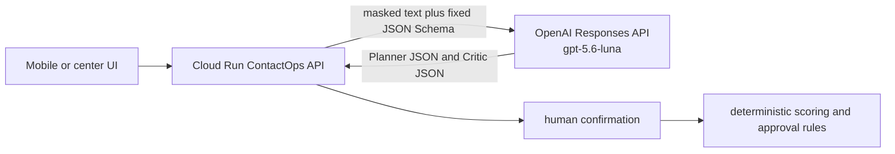

# Retired Mac mini Codex bridge archive

This file is archival rollback material. Production ContactOps text analysis now uses the direct
OpenAI Responses API with `gpt-5.6-luna` and reasoning effort `none`. Do not start the Mac mini
LaunchAgent, restore Tailscale Funnel, add `CONTACT_OPS_CODEX_BRIDGE_*` variables, or expose a
logged-in Codex session without an explicit new architecture decision and fresh end-to-end proof.

## Current production contract



The backend starts the text Planner and transcript Critic concurrently. Browser live-call candidate
refreshes also run in parallel; the UI keeps the latest successfully applied candidate when a newer
refresh fails. Luna Planner output is the source of semantic observations such as meal and
utility-arrears status. Deterministic code validates schema/enums, removes server-owned fields,
enforces phone-observation limits, and keeps the candidate unconfirmed before any scoring or
approval rule can run. If Luna Critic names exact `low_confidence_fields`, the UI keeps the Planner
value only when it is non-null and appends `(보류)`; `null` values remain `미확인`, direct select
edits clear the marker, and the marker does not block submission by itself. Audio file transcription
and Realtime transcription remain on their specialized OpenAI adapters and are not handled by this
retired bridge.

## What remains here

The `macmini-llm-bridge/` package was a bounded, authenticated text transport backed by a persistent
local `codex app-server`. It was designed to bind to `127.0.0.1:8765`, accept only the two
ContactOps schema names, validate model JSON, deny tools/commands/network, and use a non-root
Tailscale Funnel path for HTTPS ingress.

Keep that code for reference only. It is not installed by the current bootstrap commands, not tested
by the current CI path, not mapped by the deploy workflow, and not required by Cloud Run.

## If someone proposes rollback

Treat rollback as a new architecture change, not a quick environment toggle. Before any production
wire-up:

1. Prove the host, authentication boundary, Tailscale/Funnel path, health behavior, and end-to-end
   synthetic `ai-observations` request.
2. Confirm that no request body, transcript, model output, or secret appears in Mac logs.
3. Reintroduce CI tests and deploy variables in the same pull request as the runtime code change.
4. Record the successful `main` run, Cloud Run revision label, image digest, `/health` smoke, and
   deployed synthetic observation smoke.

Without that proof, use the direct OpenAI runtime only.

## Stop or inspect an old local service

These commands are for an administrator already logged into the Mac mini. They are operational
inspection commands, not deployment steps. They require a live Mac mini admin session and are not
part of this branch's verification.

```bash
launchctl print "gui/$(id -u)/kr.i5.incheon-care-codex-bridge"
launchctl bootout "gui/$(id -u)/kr.i5.incheon-care-codex-bridge"
tailscale funnel status
```

Do not run `tailscale funnel reset` unless that Mac hosts no other Funnel routes; it removes all
Funnel rules on that device.
